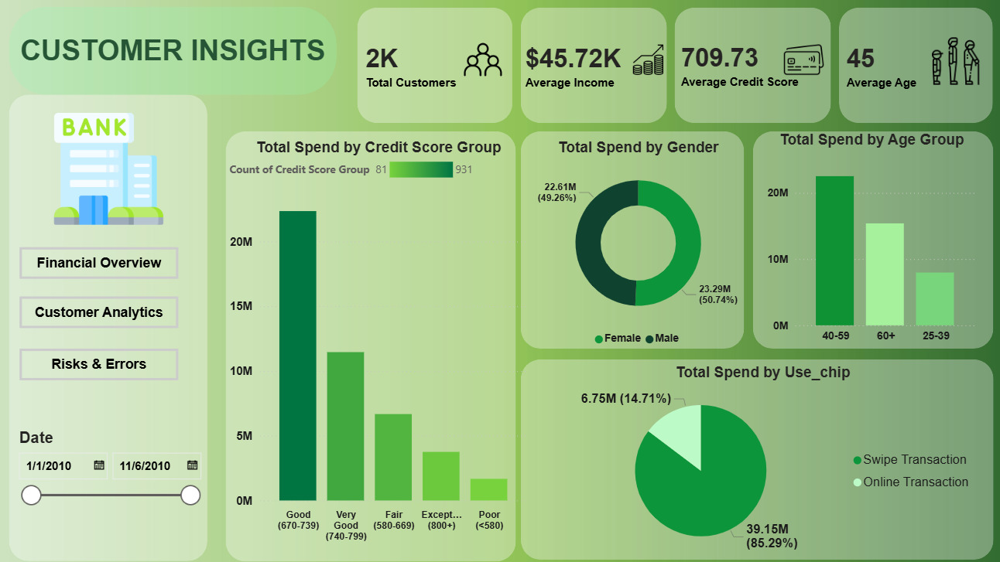
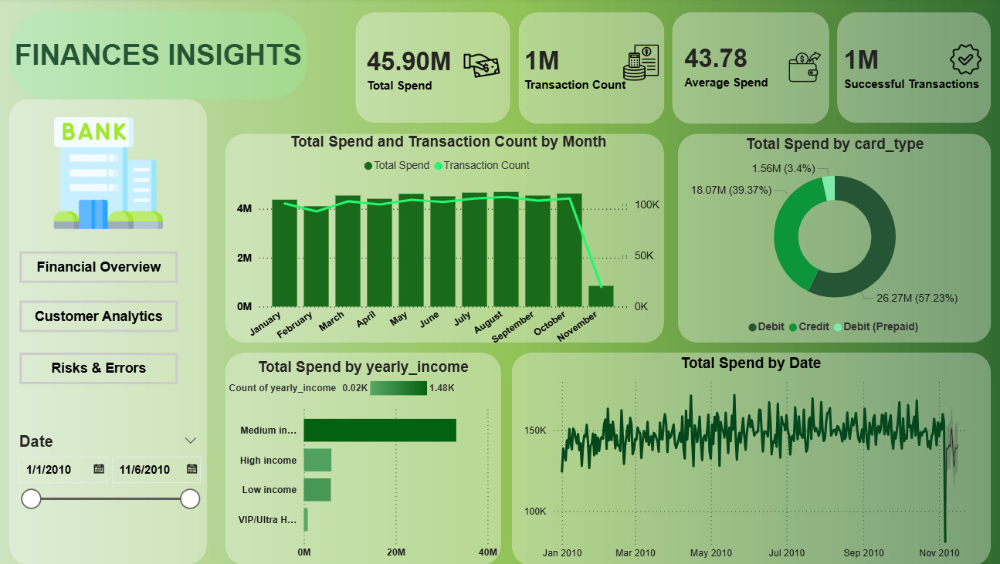
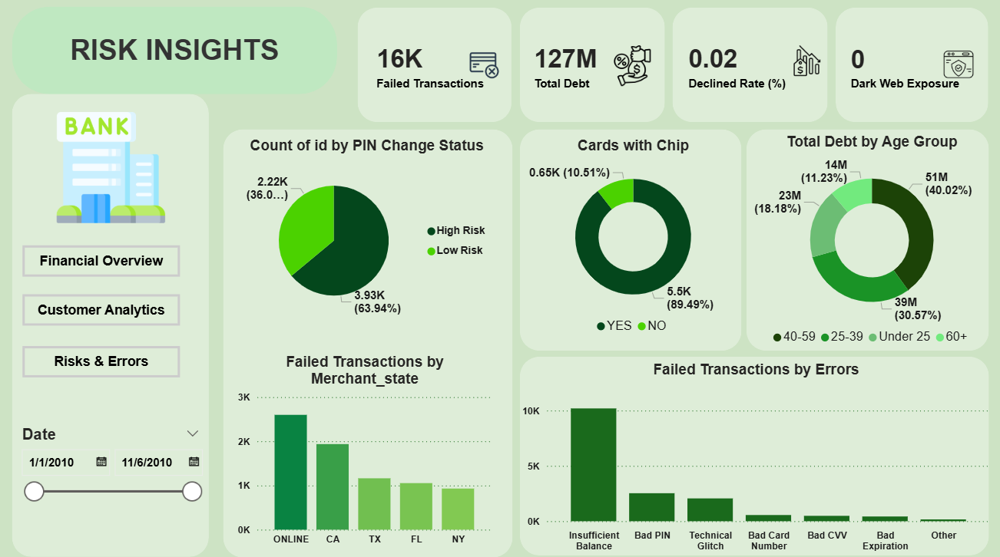

# 📊 Financial Health Dashboard

## 📌 Project Overview
This repository contains a comprehensive, production-grade **3-Page Power BI Dashboard** designed for the **Financial Health Dashboard** internship task. It analyzes banking transactions, credit risk, customer spending behaviors, and system vulnerability points.

This project goes beyond simple visual metrics to build a **data-driven business narrative (Storytelling)** that links financial trends, demographic spending profiles, and cybersecurity/credit risk anomalies to recommend strategic actions for senior bank management.

---

## 🛠️ Tech Stack & Key Skills
* **BI Platform:** Power BI Desktop
* **Data Modeling:** Star Schema (Fact and Dimension tables)
* **Features Used:** Synced Slicers, Customized Button Navigation Panels, Custom Color Themes, Hover State Animations, Visual Header Icon overrides.
* **Analysis Concepts:** Credit Risk Analysis, Customer Segmentation, Fraud Prevention Analysis, Behavioral Profiling.

---

## 📖 The Business Narrative (Storytelling & Insights)

### 💵 Chapter 1: Finances Insights (Financial Health & Volume)
* **Performance Baseline:** Analyzed **$45.90M** in total card spend across **1 Million distinct transactions**, with a steady, predictable average transaction value of **$43.78**.
* **Data Timeline & Volatility:** Spending shows a steady upward trajectory throughout the year. While November appears to have a drop-off, this is an artifact of the dataset ending on **November 6, 2010**. The consistent month-over-month growth leading up to this point indicates highly active customer card usage.
* **Card Tier Breakdown:** Debit cards represent the absolute majority of transaction volumes at **57.23% ($26.27M)**, followed by Credit cards at **39.37% ($18.07M)**. Prepaid cards represent a significant growth opportunity, capturing only **3.4%** of user transactions.

### 👥 Chapter 2: Customer Insights (Client Profiles & Spending Habits)
* **Client Baseline:** Bank manages **2,000 active clients** with an average age of **45** and a solid, low-risk average Credit Score of **709.73**.
* **Gender Spend Dynamics:** Female clients slightly dominate total transaction spending at **50.79%**, with Male clients accounting for **49.21%**. Targeted promotional campaigns tailored to female demographic preferences represent a highly optimized revenue stream for the bank.
* **Digital Commerce Gaps:** Swipe (in-store/physical) transactions overwhelmingly dominate spending at **$39.15M**, while Online transactions lag at a mere **$6.75M**. 
  * *Strategic Action:* Bank should introduce promotional campaigns (e.g., higher online cashback) to convert offline users to highly profitable e-commerce operations.


### 🛡️ Chapter 3: Risk Insights (Operational Loop-holes & System Health)
* **Operational Failures:** Over **16,000 failed transactions** were logged. The overwhelming majority of these failures are due to **Insufficient Balance (~10K errors)**, followed by **Bad PIN** errors.
* **The Debt & Insufficient Balance Contradiction (Critical Credit Risk):**
  * Total credit-card debt has risen to an alarming **$127 Million**, concentrated heavily in the 40-59 age group (40.02%).
  * *The Red Flag:* The correlation between skyrocketing "Insufficient Balance" errors and the massive $127M outstanding debt highlights extreme liquidity stress among users, signaling that clients are maxing out their credit limits.
* **Cybersecurity Gaps:** 
  * **10.51%** of active cards are still legacy **Non-chip (magnetic-stripe) cards**, making them highly vulnerable to skimming and cloning.
  * **63.94% of users are labeled as High Risk** because they have not updated their card PIN code in over 5 years.
  * *Strategic Action:* Implement a mandatory security upgrade program forcing the replacement of non-chip cards and prompt users to update expired PINs via the mobile banking app.

---

## 💻 Technical Implementation, DAX & Data Engineering

To ensure high performance and precise calculations, customized **DAX formulas** and **Data Transformation (Grouping)** methods were implemented.

### 📐 Key DAX Measures & Calculated Columns

#### 1. Dynamic Card Security Risk Classification
Used to classify customers based on their PIN update history, highlighting potential cybersecurity vulnerabilities:
```dax
Security Risk = 
IF(
    'Customer'[Years Since PIN Update] > 5, 
    "High Risk", 
    "Low Risk"
)
```
#### 2. Percentage of Non-Chip Cards
Calculates the ratio of legacy non-chip (magnetic-stripe) cards to measure potential card-skimming exposure:
```dax
% Non-Chip Cards = 
DIVIDE(
    CALCULATE(COUNT('Cards'[Card ID]), 'Cards'[Card Type] = "No Chip"),
    COUNT('Cards'[Card ID]),
    0
)
```
#### 3. Average Credit Score

Used to assess the overall creditworthiness of the bank’s active client database:
```dax
Avg Credit Score = AVERAGE('Customer'[Credit Score])
```
#### 4. Gender-based Spending Ratio

Dynamically calculates the contribution of each gender group to total transactions:
```dax
% Total Spend by Gender = 
DIVIDE(
    [Total Spend], 
    CALCULATE([Total Spend], ALL('Customer'[Gender]))
)
```
#### 📦 Data Grouping & Binning (Data Engineering)

For the segmentation analysis on Chapter 2 and Chapter 3, the following native Power BI grouping transformations were performed:

Age Demographics Grouping:
Transformed the continuous Age field into structured 10-year bins (18-29, 30-39, 40-49, 50-59, 60+) to easily identify which generation accounts for the highest credit debt ($127M concentration in the 40-59 group).
Transaction Failure Segmentation:
Grouped raw system error logs into distinct failure types: Insufficient Balance, Bad PIN, Expired Card, and Technical Error to isolate user-experience pain points.
